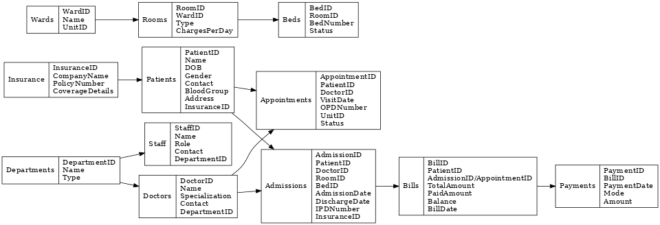

# 🏥 HIMS - Hospital Information Management System (SQL Project)

## 📌 Overview
The **Hospital Information Management System (HIMS)** is a database project developed using **SQL Server**.  
It manages hospital operations such as **OPD, IPD, Billing, Staff, Services, and Patient Records**.

This project demonstrates **SQL database design, data insertion, query building, and analysis** for real-world healthcare management.

---

## 📂 Project Structure
1. **Part 1 – Create Tables** → Database schema for hospital system  
2. **Part 2 – Insert Data** → Sample data for testing  
3. **Part 3 – Select Queries** → Queries to fetch hospital data  
4. **Part 4 – Question & Answer Queries** → Analytical queries & use cases  

---

## 🛠️ Technologies Used
- **SQL Server (T-SQL)**  
- **SSMS (SQL Server Management Studio)**  
- **GitHub (Version Control)**  

---

## 📊 ER Diagram


---

## 🚀 How to Run
1. Open **SSMS** (SQL Server Management Studio)  
2. Run `Part1_CreateTables.sql` → Creates schema  
3. Run `Part2_InsertData.sql` → Inserts data  
4. Run `Part3_SelectQueries.sql` → Runs sample queries  
5. Run `Part4_QuestionsAnswers.sql` → Case-study Q&A queries  

---

## 🎯 Key Features
- Patient Management (OPD & IPD)  
- Staff & Doctor Records  
- Billing & Charges (OPD/IPD)  
- Department & Service Management  
- Analytical Queries (Year-wise, Department-wise, Patient Count)  

---

## 📎 Demo Queries
Example:
```sql
-- Number of patients visited Medicine department in June 2022
SELECT COUNT(1) AS NumberOfPatients
FROM Visit V
INNER JOIN Doctor D ON V.DoctorID = D.DoctorID
INNER JOIN Department DP ON D.DepartmentID = DP.DepartmentID
WHERE YEAR(VisitDate) = 2022 AND MONTH(VisitDate) = 6 AND DP.Name = 'Medicine';
